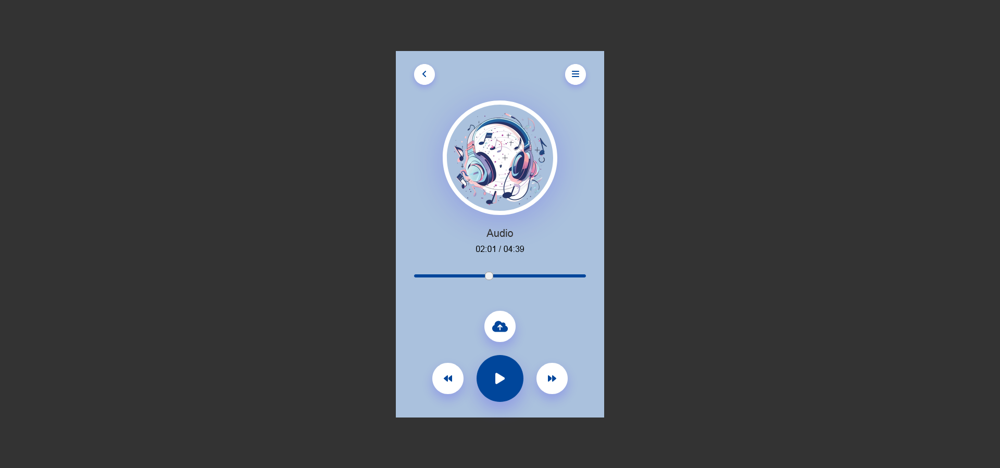

# Music Player

## Overview
This project is a simple music player built using HTML5, CSS3, and JavaScript. The player allows users to upload and play their own music files in MP3 format. It features a clean and modern design, with intuitive controls for navigating through the music library.

## Features
- Upload multiple MP3 files to the player.
- Play, pause, and navigate between songs.
- Progress bar to show the current position of the song.
- Displays the song name and current playback time.
- Simple and responsive design.

## Technologies Used
- **HTML5**: For the structure of the application.
- **CSS3**: For styling and layout.
- **JavaScript**: For interactive functionality and music playback.

## Preview

## Getting Started

### Prerequisites
To run this project, you need a modern web browser that supports HTML5 audio features.

### Installation
1. Clone the repository or download the source files.
2. Open the `index.html` file in your web browser.

### Usage
1. Click on the upload icon to select and upload MP3 files from your device.
2. The first song will automatically load and start playing.
3. Use the play, pause, next, and previous controls to navigate through your music library.
4. The progress bar updates as the song plays. You can also drag the progress bar to seek through the song.

## Code Structure
- `index.html`: The main HTML file containing the structure of the music player.
- `style.css`: The CSS file for styling the music player.
- `script.js`: The JavaScript file containing the logic for audio playback and user interactions.

## Contributing
If you would like to contribute to this project, please feel free to submit a pull request or open an issue.

## License
This project is open-source and available under the MIT License.
